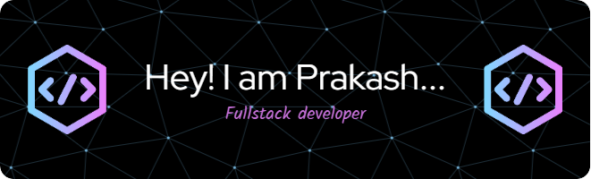

<h1 align="center">Hi 👋, I'm Prakash</h1>
<h3 align="center">A passionate Fullstack developer from India</h3>

- 🔭 I’m currently working on **React Projects**

- 🌱 I’m currently learning **Frontend dev Tools**

- 💬 Ask me about **AI-ML,Full-Stack Development Digital Marketing**

- 📫 How to reach me **prakash.arthanari2002@gmail.com**

<h3 align="left">Connect with me:</h3>

  

  

<h3 align="left">Languages and Tools:</h3>

                           

&nbsp;

